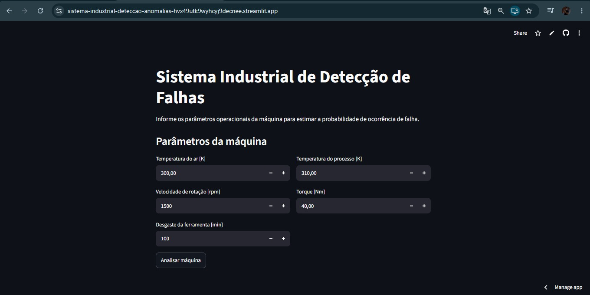
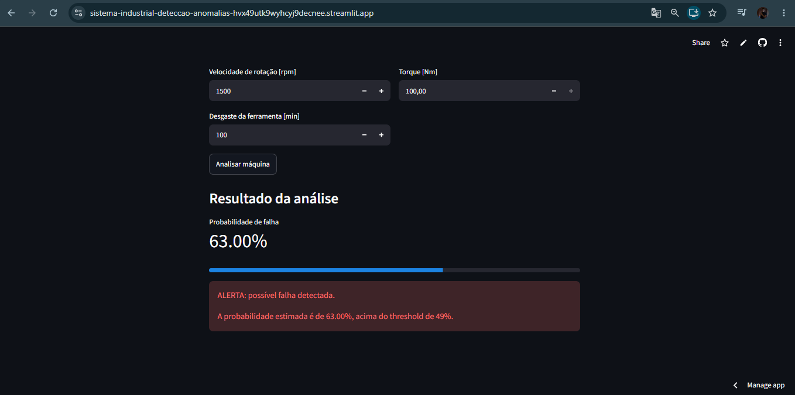

# Sistema Industrial de Detecção de Falhas

Projeto de Machine Learning para identificar possíveis falhas em máquinas industriais a partir de dados de temperatura, rotação, torque e desgaste da ferramenta.

A aplicação permite informar os parâmetros de uma máquina e receber uma estimativa da probabilidade de falha.

## Demonstração

[**Acessar aplicação no Streamlit**](https://sistema-industrial-deteccao-anomalias-hvx49utk9wyhcyj9decnee.streamlit.app)

### Aplicação



### Resultado



## Sobre o projeto

O projeto foi desenvolvido passando pelas principais etapas de um projeto de Machine Learning:

- Análise exploratória dos dados
- Preparação dos dados
- Treinamento e comparação de modelos
- Validação cruzada
- Escolha do threshold
- Avaliação dos resultados
- Análise dos erros
- Desenvolvimento e deploy da aplicação

O modelo final utilizado foi uma **Random Forest**, com threshold de **0,49**.

## Dataset

Foi utilizado o **AI4I 2020 Predictive Maintenance Dataset**, disponível no UCI Machine Learning Repository.

Principais variáveis utilizadas:

- Temperatura do ar
- Temperatura do processo
- Velocidade de rotação
- Torque
- Desgaste da ferramenta

A variável alvo é `Machine failure`.

## Resultados

| Métrica | Resultado |
|---|---:|
| Accuracy | 98,10% |
| Precision | 72,06% |
| Recall | 72,06% |
| F1-score | 72,06% |

No conjunto de teste, o modelo identificou corretamente **49 dos 68 casos de falha**.

As variáveis com maior importância para o modelo foram:

| Variável | Importância |
|---|---:|
| Torque | 32,82% |
| Rotational speed | 30,62% |
| Tool wear | 22,49% |

## Aplicação

A aplicação foi desenvolvida com **Streamlit** e utiliza o modelo salvo com `joblib`.

O usuário informa os dados da máquina e recebe:

- Probabilidade estimada de falha
- Resultado da análise
- Alerta quando a probabilidade ultrapassa o threshold definido

## Tecnologias

- Python
- Pandas
- NumPy
- Scikit-learn
- Random Forest
- Logistic Regression
- Jupyter Notebook
- Joblib
- Streamlit
- Git e GitHub

## Estrutura do projeto

```text
sistema-industrial-deteccao-anomalias/
│
├── data/
│   └── raw/
├── images/
├── models/
│   └── random_forest_model.pkl
├── notebooks/
│   └── EDA.ipynb
├── src/
├── app.py
├── requirements.txt
├── README.md
└── .gitignore
```

## Como executar

```bash
git clone https://github.com/joaovitorsoska/Sistema-industrial-deteccao-anomalias.git

cd Sistema-industrial-deteccao-anomalias

python -m venv .venv

.venv\Scripts\activate

python -m pip install -r requirements.txt

python -m streamlit run app.py
```

## Próximos passos

- Testar outros modelos
- Ajustar hiperparâmetros
- Melhorar a interface
- Reduzir falsos negativos
- Explorar os diferentes tipos de falha

## Autor

**João Vitor Soska**

Estudante de Inteligência Artificial e Machine Learning.

[GitHub](https://github.com/joaovitorsoska)